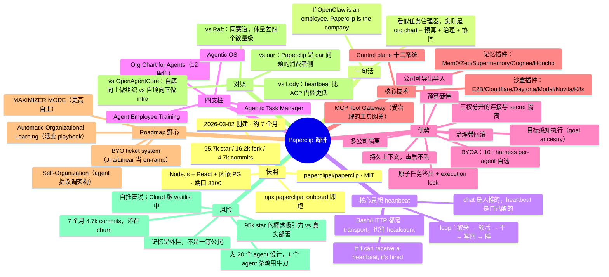

# paperclip-research

**Paperclip 调研报告**：给 AI agent 发 org chart、定目标、批预算、做审计的开源 control plane —— 它的优势与核心技术。

> 调研日期：2026-10-02 ｜ 对象版本：`paperclipai/paperclip` master 分支（commit `6395cae`）
> 一句话：**"If OpenClaw is an employee, Paperclip is the company."**

## 1. 项目快照（原始数）

| 项 | 数 |
|---|---|
| 仓库 | `paperclipai/paperclip`，MIT |
| 创建 | 2026-03-02（约 7 个月） |
| Star / Fork / Watch | 95,678 / 16,231 / 454（调研日实测） |
| 增长 | 2026-07-14 约 73.6k → 2026-10-02 95.7k，两个半月 +22k |
| Commits / Tags / Releases | 4,696 / 1,691 / 26 |
| 形态 | Node.js server + React UI，嵌入式 PostgreSQL，自托管，端口 3100 |
| 分发 | npm `paperclipai`（calver `YYYY.MDD.patch`）、`@paperclipai/server`、`@paperclipai/plugin-sdk`、`@paperclipai/skills-catalog`；Docker `ghcr.io/paperclipai/paperclip` |
| 上手 | `npx paperclipai onboard --yes` 或 `bash install.sh`，无账号要求 |
| 外围 | paperclip.ing（官网）/ docs.paperclip.ing / X @papercliping / Discord；**Paperclip Cloud 在 waitlist** |

## 2. 核心思想：heartbeat（心跳）

Paperclip 反对的不是某个具体 agent，而是这个现状：**"20 个 Claude Code 终端开着，重启一下全蒸发了"**。

它的解法浓缩在一句口号里：

> **"If it can receive a heartbeat, it's hired."**

chat session 是 push-based、人驱动的：活在 context window 里，窗口一关 worker 就没了。heartbeat worker 是一个 loop：**按时醒来 → 问服务器欠我什么活 → 干一个单元 → 写回结果 → 睡**。这就是为什么连 shell 脚本都能当员工——兼容列表里 Bash 和 HTTP 不是 agent 产品，是 transport，而 transport 也算 headcount。

四根支柱（README 原话）：

1. **Agentic Task Manager** — Declare intent. Agents work. You verify the output.（任务、审批、review gate）
2. **Org Chart for Agents** — 人和 agent 混编的汇报线：12 种角色（ceo、cto、cmo、cfo、security、engineer、designer、pm、qa、devops、researcher、general），职责、授权、边界
3. **Agent Employee Training** — Skill Studio、evals、给 agent 做"绩效考核"和版本回滚
4. **Agentic OS** — 跨 provider runtime、沙盒、SSO/GRC/RBAC、成本控制、数据沉淀

DESIGN.md 的产品立场写得很直白：operational control plane，每一屏只回答三个问题——*发生了什么、需不需要我、我该干什么*。

## 3. 优势

1. **BYOA（Bring Your Own Agent）**：OpenClaw、Claude Code、Codex、Cursor、Gemini CLI、OpenCode、Pi、Hermes、Grok Build、Kimi Code，外加 bash/HTTP——per-agent 自选模型和 harness，任务/skills/历史留在同一个组织里。
2. **心跳执行模型**：agent 按分配的工作、follow-up 消息或配置的 schedule 醒来；delegation 沿 org chart 上下流动。这是"主动性"的基础设施化。
3. **原子任务签出**：single assignee + execution lock，杜绝两个 run 抢同一个任务。
4. **持久工作上下文**：任务、评论、文档留在 Paperclip；adapter 负责跨 run 恢复 session。重启不丢。
5. **带回滚的治理**：审批门强制执行，配置变更版本化，改坏了能滚回去。
6. **可问责的连接**：human access、agent eligibility、gateway action（Allowed / Ask first / Off）三权分开；secret 按角色隔离——marketing bot 拿不到生产凭证。
7. **目标感知的执行**：任务带 goal ancestry，agent 看到的不只是标题，还有"为什么做"。
8. **预算硬停**：公司/agent/项目三级预算，到线自动暂停，阈值告警。runaway loop 烧钱是这个品类最痛的坑，它直接做成了 control plane 的一等公民。
9. **可移植的公司**：org、agent、skill 可导出/导入（secret 自动 scrub），公司本身成了可分发 artifact。
10. **组织边界**：一次部署跑多家公司，数据、agent、审计各自隔离。

## 4. 核心技术

### 4.1 Control plane 十二系统

```
┌──────────────────────────────────────────────────────────────┐
│                       PAPERCLIP SERVER                       │
│  Identity & Access │ Work & Tasks │ Heartbeat Execution │ Governance & Approvals │
│  Org Chart & Agents │ Workspaces & Runtime │ Plugins │ Budget & Costs │
│  Routines & Schedules │ Secrets & Storage │ Activity & Events │ Company Portability │
└──────────────────────────────────────────────────────────────┘
        ▲                ▲                ▲                ▲
   Claude Code        Codex          CLI agents        HTTP/web bots
```

关键所有权划分：**Paperclip 拥有组织的观察、任务、预算与治理语义；agent 拥有自己的 prompt、模型与 runtime**。它不教你怎么造 agent，它管 agent 组成的公司。

### 4.2 沙盒与记忆：两条已验证的扩展线

- **Cloud / Sandbox agent 支持**（已交付）：E2B、Cloudflare、Daytona、Modal、Novita、Kubernetes 都是 sandbox provider 插件——remote execution，但 control-plane 模型不变。轻量云端沙盒这条路，Paperclip 已经铺好了。
- **Memory / Knowledge**（实验中）：Mem0、Zep、Supermemory、Cognee、Honcho 都是 memory connection 插件。记忆是外挂的，不是内置的。

### 4.3 Roadmap 里的野心（⚪ 计划项最值得看）

- **MAXIMIZER MODE**：更高自主的执行——更激进的 delegation、更深的 follow-through，但"不是 hidden autonomy"，每一步都在预算+可见+治理之内。
- **Self-Organization**：公司大了，agent 可以提议调组织架构（角色调整、delegation 变更、新 routine），仍在审批边界内。
- **Automatic Organizational Learning**：把做完的活变成 playbook、recurring fix、decision pattern——公司越干越聪明。
- **Bring-your-own-ticket-system**：Asana / Linear / Jira 只当 on-ramp，Paperclip 拥有执行、治理与结果。

## 5. 对照（2026-10-02 同一晚研究的阵容）

| 项目 | 层 | Star | 关系 |
|---|---|---|---|
| **Paperclip** | 公司 OS（管 agent 的组织） | **95k** | 本报告对象 |
| Loro | 数据结构（CRDT 会话同步） | 6.2k | 可做 Paperclip 任务/文档的多端一致性底座 |
| oar | 编程接口（library 统一 harness） | 143 | Paperclip 的 multi-harness teams 正是 oar 想解决的问题的**消费者侧** |
| OpenAgentCore | 自托管 agent core 平台 | 105 | 同是 control plane，但自顶向下做 infra（OpenAI Agents API）；Paperclip 自底向上做组织 |
| Lody | 协作工作区（ACP 统一接入） | — | Lody 用 ACP 统一 agent；Paperclip 用 heartbeat，门槛更低（bash 脚本都能当员工） |
| Raft (botiverse) | 协作 SaaS（Discord 式） | ~13（文档仓） | 同一赛道、体量差四个数量级；Raft 闭源 SaaS，Paperclip MIT 自托管 |

TiDB 联创 CTO 自称 "Agent Resource Manager"——Paperclip 干的就是把这个**职位**产品化。

## 6. 风险与边界

1. **快**：7 个月 4,696 commits，概念和 API 还在 churn，"thin core, rich edges" 的插件边界是进行时。
2. **重**：org chart 隐喻是为"20 个 agent"准备的；官方自己也说，只有一个 agent 你不需要 Paperclip。
3. **自托管税**：MIT + 自托管 = 运维是自己的事；Cloud 版还在 waitlist，多租户云是进行时。
4. **Star 含水量**：95k star 里有多少是"点了 star 但没跑起来"的，README 的概念吸引力（"If OpenClaw is an employee…"）本身就是增长引擎——这是优点也是风险。
5. **记忆外挂**：memory 是插件不是一等公民，长期记忆的"灵魂"问题它交给了 Mem0/Zep 们。

## 7. 思维导图

- Mermaid 版见下；可交互折叠版：[`mindmap.html`](./mindmap.html)



---

*交互式思维导图：[`mindmap.html`](./mindmap.html)（点击节点展开/折叠）*
